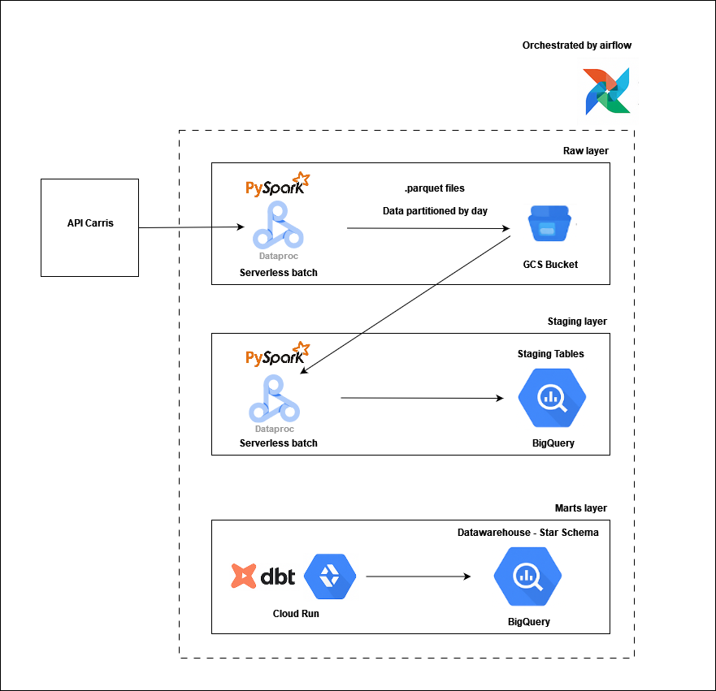
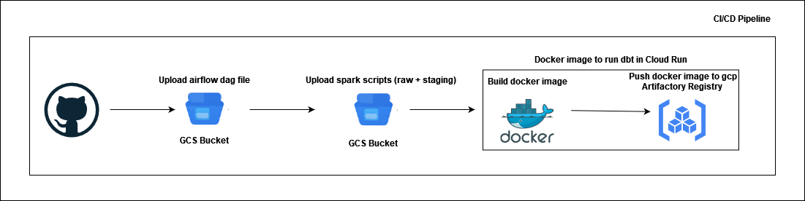

# Carris Data Platform

This repository contains the infrastructure and code for a data platform that ingests, processes, and models public transport data from Carris Metropolitana, the public transport authority for the Lisbon metropolitan area. The platform is built on Google Cloud Platform (GCP) and uses a modern data stack including Spark, dbt, Airflow, and Docker.

## Architecture

The data pipeline follows a multi-layered architecture (Raw, Staging, Marts) to ensure data quality, scalability, and ease of use for analytics.



1.  **Data Ingestion (Raw Layer)**
    *   A PySpark script (`src/raw/extract_carris.py`) fetches data from the Carris Metropolitana API endpoints and the GTFS static feed.
    *   The raw data is partitioned by date and stored in Parquet format in a Google Cloud Storage (GCS) bucket.

2.  **Data Processing (Staging Layer)**
    *   A series of PySpark jobs are run on Dataproc Serverless to process the raw data:
        *   `load_to_bigquery.py`: Reads the raw Parquet files from GCS, applies predefined schemas, cleans the data, and loads it into staging tables in Google BigQuery.
        *   `merge_gtfs_and_endpoint.py`: Merges and unifies datasets that have sources from both the GTFS feed and the API (e.g., `stops`, `routes`).
        *   `convert_array_columns.py`: Transforms stringified JSON arrays into native BigQuery ARRAY types for easier querying.


3.  **Transformation/Mart Layer (dbt)**: A dbt project (`src/marts/dbt/carris_transformations`) transforms the staging data into a clean, well-structured dimensional model suitable for analytics.
    *   **Staging Models**: Light transformations on top of the BigQuery staging tables.
    *   **Dimension Models**: Creates dimension tables like `dim_stop`, `dim_trip`, `dim_line`, and `dim_calendar_service`.
    *   **Fact Models**: Creates fact tables like `fact_trip_schedule` (aggregating trip metrics) and `fact_stop_event` (detailing every stop event for a trip).

4.  **Orchestration & Deployment**
    *   **Airflow**: An Airflow DAG (`src/orchestration/grupo1-pipeline.py`) orchestrates the entire pipeline, triggering the Dataproc jobs in the correct sequence.
    *   **Cloud Run**: A Dockerized Cloud Run job is used to execute the dbt transformations. The Airflow DAG triggers this job after the staging jobs are complete.
    *   **GitHub Actions**: A CI/CD workflow (`.github/workflows/build_deploy.yml`) automates the deployment process. On a push to `main`, it uploads the latest Spark scripts to GCS and builds/pushes the dbt Docker image to Google Artifact Registry.

## Technology Stack

*   **Cloud Provider**: Google Cloud Platform (GCP)
*   **GCP Services**:
    *   Cloud Storage (GCS)
    *   Dataproc Serverless (for Spark)
    *   BigQuery (Data Warehouse)
    *   Cloud Run (for dbt)
    *   Artifact Registry (Docker Images)
    *   Cloud Composer (for Airflow)
*   **Data Processing**: Apache Spark (PySpark)
*   **Data Transformation**: dbt
*   **Orchestration**: Apache Airflow
*   **CI/CD**: GitHub Actions, Docker

## Project Structure

```
.
├── .github/workflows/        # GitHub Actions CI/CD pipeline
├── config/                   # Pipeline configuration files
├── src/
│   ├── marts/                # Marts layer: dbt project for data transformation
│   │   └── dbt/
│   │       └── carris_transformations/
│   ├── orchestration/        # Orchestration layer: Airflow DAGs and Cloud Run configs
│   ├── raw/                  # Raw layer: Spark script for data extraction
│   └── staging/              # Staging layer: Spark scripts for data processing and schemas
└── requirements.txt          # Python dependencies
```

## Setup and Execution

### Prerequisites

*   A Google Cloud Platform project.
*   A Service Account with necessary permissions for GCS, BigQuery, Dataproc, Cloud Run, and Artifact Registry.
*   GCS buckets for raw data and Spark scripts.
*   BigQuery datasets for staging and mart tables.
*   An Airflow environment (e.g., Google Cloud Composer).

### Deployment

The deployment is automated via the GitHub Actions workflow in `.github/workflows/build_deploy.yml`. To enable this, you must configure a `GCP_SA_KEY` secret in your GitHub repository settings containing the JSON key for your service account.

The workflow performs the following steps:
1.  **Authenticates** to Google Cloud.
2.  **Uploads** the PySpark scripts from `src/staging/spark/` and `src/raw/` to the designated GCS bucket.
3.  **Builds** the Docker image for the dbt Cloud Run job located at `src/orchestration/cloud_run_jobs/`.
4.  **Pushes** the Docker image to Google Artifact Registry.



### Running the Pipeline

The end-to-end pipeline is triggered by the Airflow DAG `grupo1-pipeline`. Once deployed to your Airflow environment, you can enable and trigger it from the Airflow UI. The DAG will execute the following tasks in order:

1.  **Dataproc Job (Extraction)**: Runs `extract_carris.py` to ingest the latest data into GCS.
2.  **Dataproc Jobs (Staging)**: Executes the Spark scripts to load, merge, and clean the data in BigQuery staging tables.
3.  **Cloud Run Job (Transformation)**: Triggers the Cloud Run job, which clones the repository and runs `dbt build` to update the analytical models in the BigQuery mart dataset.
